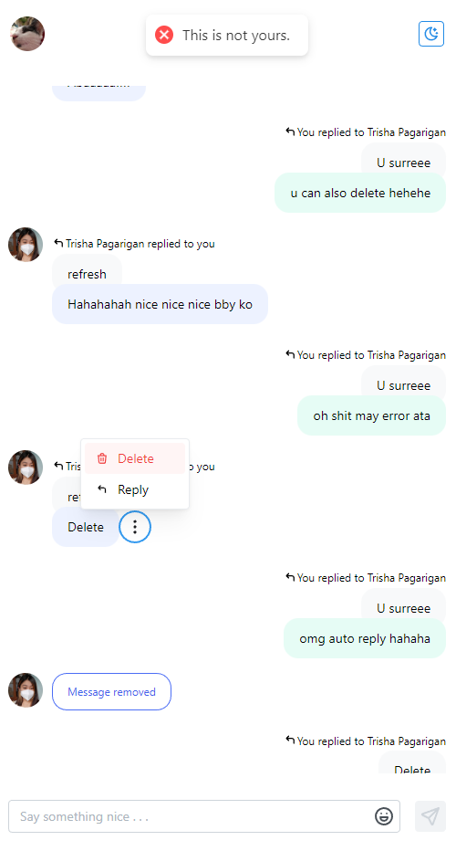
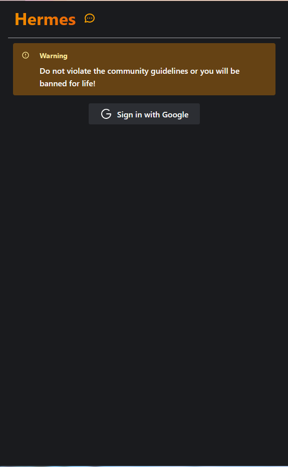
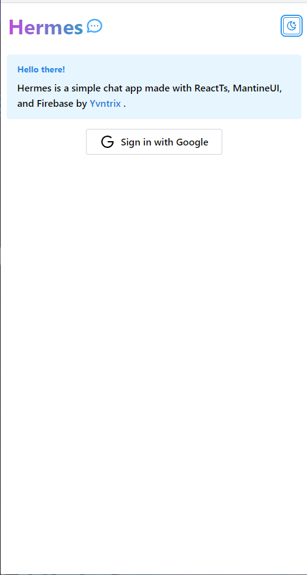
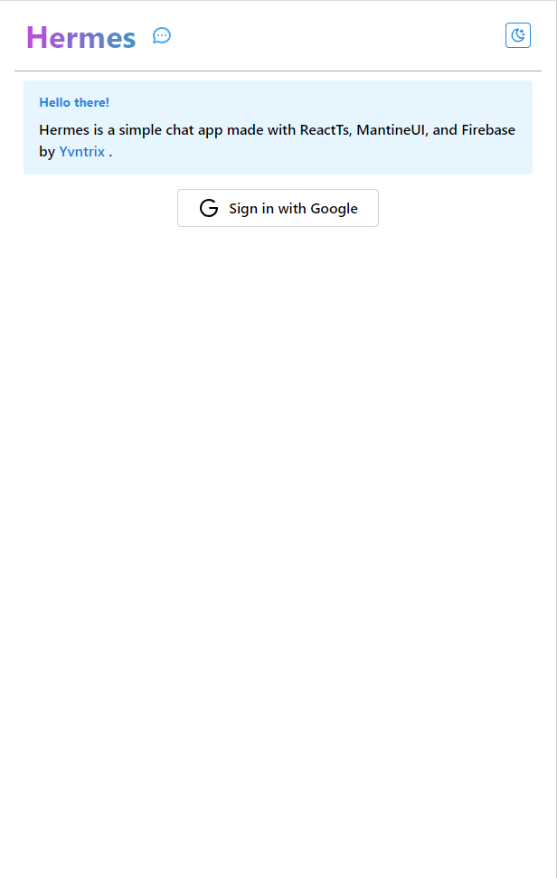
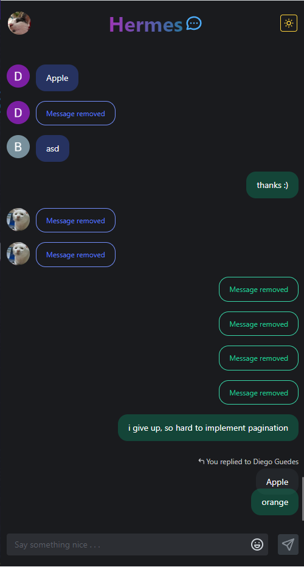
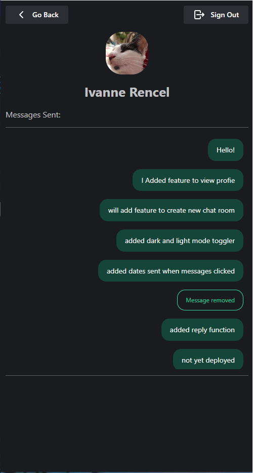

# Hermes Chat App

A simple chat web app made with react and firebase

### Status

### Link

https://hermes-chats.netlify.app/

https://hermes-chats.vercel.app/

## Screenshots

     
     

## Features

- Google Authentication
- chat realtime
- remove messages sent
- reply to specific messages
- view profile

## Built with

- React
- Typescript
- Mantine Ui
- Firebase Firestore
- Firebase Authentication

## License

This project is licensed under the GPL-3.0 - see the license file for more details
